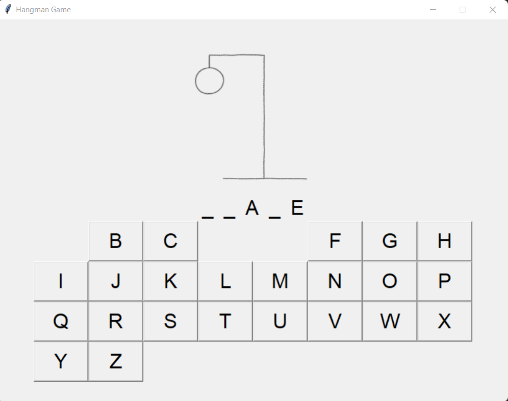
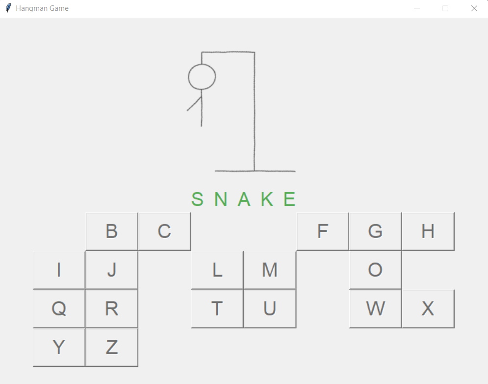
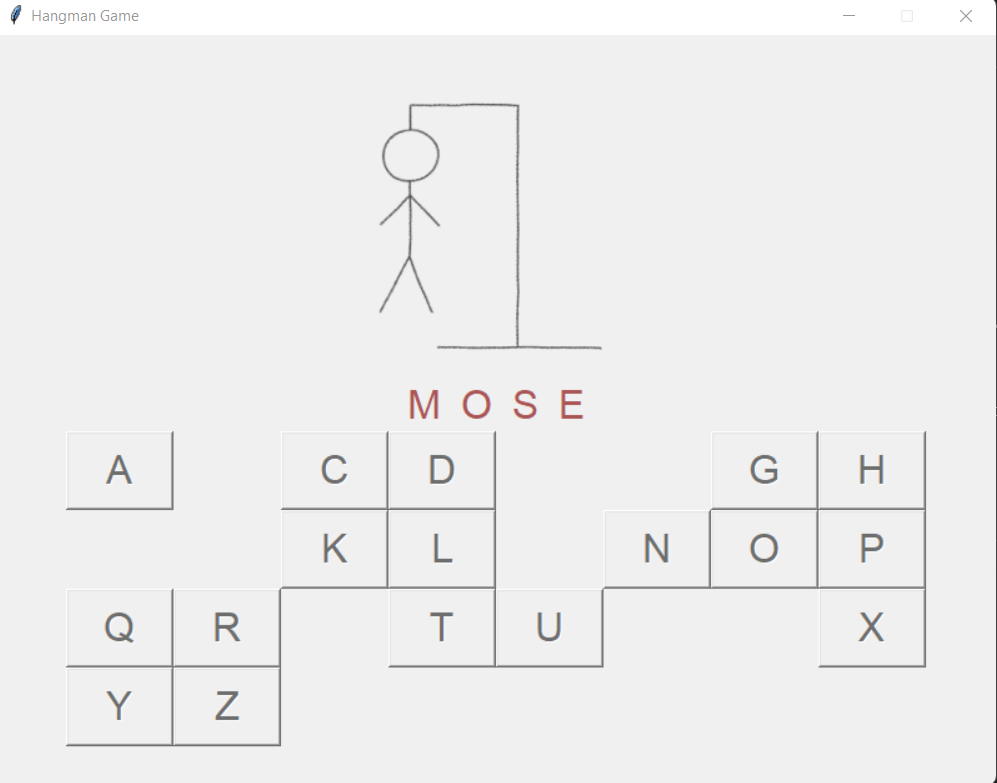

# Hangman





## Run Game
```python
python hangman.py
```

## Restart Game
To restart game close window and run "run game" command again

## Change pool of words
To change pool of words simply replace content of resources/words.txt with needed words